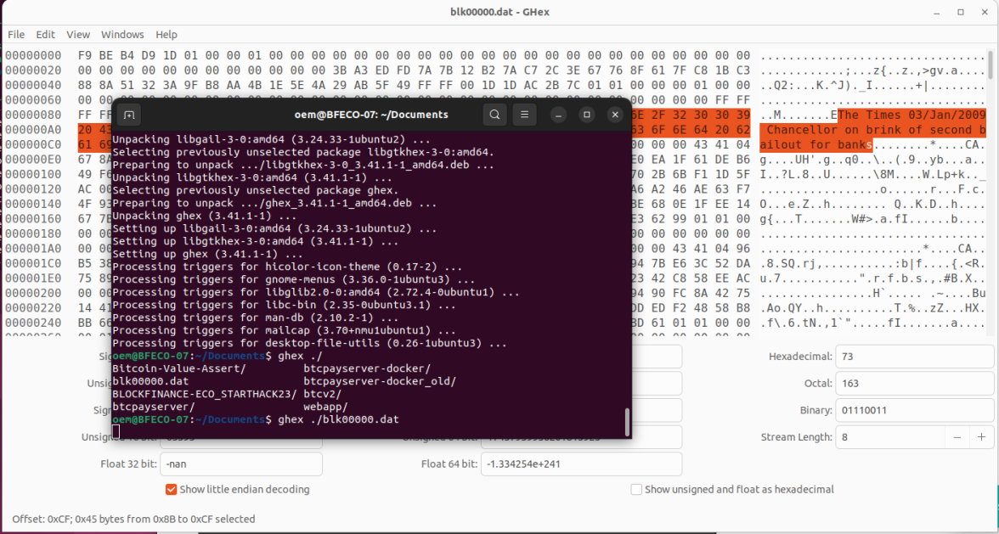

# STARTHACK23

Challenge: Blockchain, CryptoWorkspace - BlockFinance ECO AG

## Content of the repository
- Web app
- Webhook handler

### Challenges and Evaluation Criteria:

- [x] Setting up a Bitcoin wallet structure using BIP-85 (Bitcoin Improvement Proposal 85) involves creating a hierarchical deterministic (HD) wallet to securely store and manage your company's Bitcoin funds. BIP-85 provides a way to structure the HD wallet into multiple segments or accounts, allowing you to allocate specific funds for accounting, salaries, fundraising, etc. By creating multiple BIP39 seeds, you can ensure that each account has its own unique seed for added security and backup purposes. This structure ensures that your company's Bitcoin funds are managed in a secure and organized manner, making it easier to track and access them as needed. 
(10 points)

- [x] Create a Bitcoin company vault wallet that will be used to fund the company derived from the BIP-85 seed. (5 points)

Address: 

- [x] Raise funds on your fundraising Bitcoin wallet, which is also set up from the BIP-85 wallets, and get funded from the angel investor at the Blockfinance ECO AG booth. To receive your angel investment, you need to sign a message from one of your addresses in your Bitcoin fundraising wallet and send it to the Blockfinance ECO AG team on Discord or personally. Use the https://github.com/Blockfinance-ECO/Bitcoin-Value-Assert tool to create the timestamp and message of your fundraising Bitcoin wallet. (10 points)

- [x] Ensure you run your Bitcoin node with API access and txindex=1 in your bitcoin.conf file. (10 points)

- [x] Set up your Bitcoin Payment Server (BTCPay) and connect it to your own Bitcoin node. (10 points)
  - additional 15 point for: 
  - [x] Create your first invoice and send the link to Blockfinance ECO AG staff for review (3 points). Use 5€ as the total payment amount.
  - [x] Access the API of the Bitcoin payment server and write a wrapper in a scripting language of your choice or set up a small website to:
  - [x] Set up a product for sale.
  
  - [x] Generate an automated invoice using the API for this product.
  
  - [x] Check if the invoice was paid, save everything related to the payment in a local database of your choice.
  - [ ] Automatically move 75% of the invoice money to your company vault wallet.  (https://docs.btcpayserver.org/CustomIntegration/, https://docs.btcpayserver.org/API/Greenfield/v1/)
  - [x] Get creative and show some more possible use cases (not getting more points for it, just for yourself and your later success) 

- [x] Provide accounting statements of all your Bitcoin wallets using the Bitcoin wallet of choice or the CryptoWorkspace with the transaction lookups and CSV exports. Add additional metadata to each transaction for your accountant to understand each transaction. (5 points)

See `TxLookup-523e0ebe78b7af518357b8dd064a35ba6846ce9bff13c52082386dee885c8659`

- [x] Extract the hidden message in the Bitcoin Genesis Block (https://en.bitcoin.it/wiki/Genesis_block) using your Bitcoin node. (5 points)

- [x] Write a script that looks for Bitcoin messages in every other Bitcoin block. (5 points)

Look into `blockchain-parser` for the code.

- [x] Create one paperwallet for a newborn baby of one of your employees. (don’t fund it , just create one with a greeting card) (5 points)

- [x] Participants should make sure acquireto acquire the necessary documentation for onboarding with the designated Bitcoin exchange, CryptoBus, to buy or sell Bitcoin for Swiss Francs. They should approach the exchange during the Hack-Challenge and provide their company name to begin the onboarding process. It is important to inquire with the exchange regarding any specific requirements for onboarding. You need to independelty look for the CryptoBus to get a chance for onboarding. (15 points)

See `txLookup-1.pdf`

- [x] Be creative surprise us and show how it adds value (5 points).

See this repository [https://github.com/andics/dishcoin](https://github.com/andics/dishcoin)